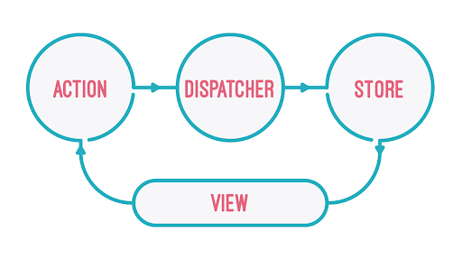
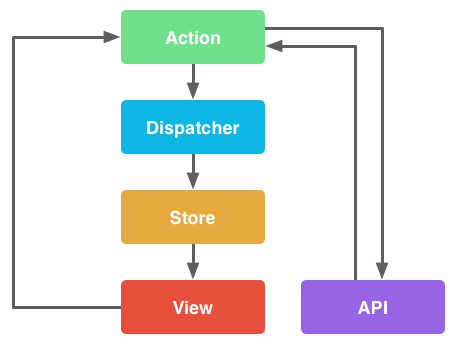

# 2. Flux архитектура. Redux

Мы уже научилсь подходу Dependency Injection внутри React через Context и стали ближе к правильной архитектуре ,больших пприложений.

И следующий шаг, это отделить всю логику с данными от отображения (View).

Для решения таких задач стали появляться менеджеры состояния.
Одним из первых стал подход использующий Flux архитектуру - Redux.

Особенности Flux архитектуры:
1. Однонаправленный поток данных - помогает сделать код более предсказуемым
2. Изменения данных только через Dispatcher
3. Четкое разделение слоев приложения

Ключевые компоненты Flux архитектуры:
- Action (Действие)
- Dispatcher (Отправитель)
- Store (Хранилище)
- View (Отображение)



Action - это выраженное действие, которое должно происходить в хранилище. Следующее действие не может быть передано в Store, пока полностью не обработается предыдущее событие. Действие обычно состоит из названия (или типа действия) и может иметь полезную нагрузку (payload).

```jsx
{
   type: "SET_FIRSTNAME",
   payload: {
     firstname: "Evgeniy"
   }
}
```

Dispatcher – это механизм, принимающий в себя все действия и распределяющий их между всеми зарегистрированными обработчиками.

Store – это компонент, который включает в себя текущее состояние и логику приложения. Только он знает, как нужно реагировать на входящие действия и как изменять состояние приложения.

View – компонент приложения, отвечающего за отображение информации, поступающей ему со Store. Он может создавать новые действия и передавать их Dispatcher.

Обработка всех событий в Flux синхронна, асинхронные вызовы могут происходить только при создании событий.



Мы сейчас разобрали отдельную “концепцию”, которая применяется в разработке приложений и очень хорошо ложится на событийную модель браузера и javascript, так как пользователь постоянно взаимодействует с UI, но важно понимать, что Flux архитектура может использовать и в других языках.

Давайте разберем пример и постараемся применить Flux архитектуру к нему:

```jsx
// Пример состояния и его инициализации
const state = { firstname: "" }

// Где-то внутри приложения
state.firstname = "Evgeniy" // новое имя
```

Как видите сейчас `state` мы можем менять в любом месте так как всегда имеем доступ к объекту `state` в окружении модуля, соответственно, первым шагом нам нужно “инкапсулировать” доступ к объекту `state` - замыкание в javascript!

```jsx
const createStore = (initialState) => {
   let state = initialState;
   return {
      getState: () => state,
   }
}

const store = createStore({ firstname: "" });

store.getState(); // { firstname: "" } – так как это начальное значение состояния
```

Вспоминаем, что только `Store` должен знать, как нужно реагировать на входящие действия и как изменять состояние приложения.

Напишем пример `Dispatcher`, который будет принимать `Action` и выступать  как setter для текущего `state` и будет доступен извне store как и `getState` , назовем его `dispatch`

```jsx
 const createStore = (initialState) => {
   let state = initialState;
   return {
      dispatch: (action) => {
         if (action.type === "SET_FIRSTNAME") {
           state.firstname = action.payload.firstname;
         }
      },
      getState: () => state,
   }
}

const store = createStore({ firstname: "" });

store.getState(); // { firstname: "" } – так как это начальное значение состояния

store.dispatch({
   type: "SET_FIRSTNAME",
   payload: {
      firstname: "Evgeniy"
   }
});

store.getState(); // { firstname: "Evgeniy" }
```

Мы применили почти все принципы Flux!
У нас есть однонаправленный поток данных, и получать `state` можем через `store.getState()`, менять только с помощью  `store.dispatch(action)` .

Но, с количеством новой логике, новых `actions` наш текущий `createStore` будет расширятся и рано или поздно превратиться в большое полотно.
Нужно научиться конфигурировать изменения `state`!

По классике это называют `reducer`, эта функция должна возвращать измененное состояние или текущее, если инструкцию для изменения к `action.type` мы еще не определили:

```jsx
const reducer = (state, action) => {
  switch (action.type) {
    case "SET_FIRSTNAME":
      state.firstname = action.payload.firstname;
      return state;
    default:
      return state;
  }
}
```

И теперь, мы можем добавить в `createStore` аргумент `reducer`:

```jsx
const reducer = (state, action) => {
  switch (action.type) {
    case "SET_FIRSTNAME":
      state.firstname = action.payload.firstname;
      return state;
    default:
      return state;
  }
}

const createStore = (reducer, initialState) => {
   let state = initialState;
   return {
      dispatch: (action) => {
         state = reducer(state, action);
      },
      getState: () => state,
   }
}
```

Если посмотрим на аргументы `createStore`, то по нашей логике `reducer` и `initialState` отвечают за одно действие - изменения `state`, соответвенно можно перенести `initialState` как значение по умолчанию в первый аргумента `reducer` и тогда вместо `let state = initialState` использовать уже функцию `reducer`:
```jsx
const initialState = { firstname: "" };

const reducer = (state = initialState, action) => {
  switch (action.type) {
    case "SET_FIRSTNAME":
      state.firstname = action.payload.firstname;
      return state;
    default:
      return state;
  }
}

const createStore = (reducer) => {
   let state = reducer(undefined, {});
   return {
      dispatch: (action) => {
         state = reducer(state, action);
      },
      getState: () => state,
   }
}
```
Отмечу, что для получаения начального значения `state`, необходимо в `reducer` передавать первым аргументов - `undefined` (чтобы сработало `initialState`) и вторым `{}` (иначе `action.type` выдаст ошибку).

Так же, в каждом вызове `store.dispatch(action)` сейчас нам прийдется копировать ту же структуру action с `SET_FIRSTNAME`:

```jsx
store.dispatch({
   type: "SET_FIRSTNAME",
   payload: {
      firstname: "Evgeniy"
   }
});

store.dispatch({
   type: "SET_FIRSTNAME",
   payload: {
      firstname: "Mary"
   }
});
...
```

И логичней выносить `action` с определенным `type` отдельно в функции с аргументом `firstname` и это будет `setFirstnameActionCreator`:

```jsx
const setFirstnameActionCreator = (firstname) => ({
   type: "SET_FIRSTNAME",
   payload: {
      firstname: firstname,
   }
});
// setFirstnameActionCreator("Evgeniy"); // функция возвращает объект

store.dispatch(setFirstnameActionCreator("Evgeniy");
store.dispatch(setFirstnameActionCreator("Mary");
...
```

После улучшений исходный пример будет иметь теперь такой вид:

```jsx
const setFirstnameActionCreator = (name) => ({
   type: "SET_FIRSTNAME",
   payload: {
      firstname: firstname
   }
});

const initialState = { firstname: "" };

const reducer = (state = initialState, action) => {
  switch (action.type) {
    case "SET_FIRSTNAME":
      state.firstname = action.payload.firstname;
      return state;
    default:
      return state;
  };
};

const createStore = (reducer) => {
   let state = reducer(undefined, {});
   return {
      dispatch: (action) => {
         state = reducer(state, action);
      },
      getState: () => state,
   }
}

const store = createStore(reducer);

store.getState(); // { firstname: "" } – так как это начальное значение состояния

store.dispatch(setFirstnameActionCreator("Evgeniy"));

store.getState(); // { firstname: "Evgeniy" }
```

